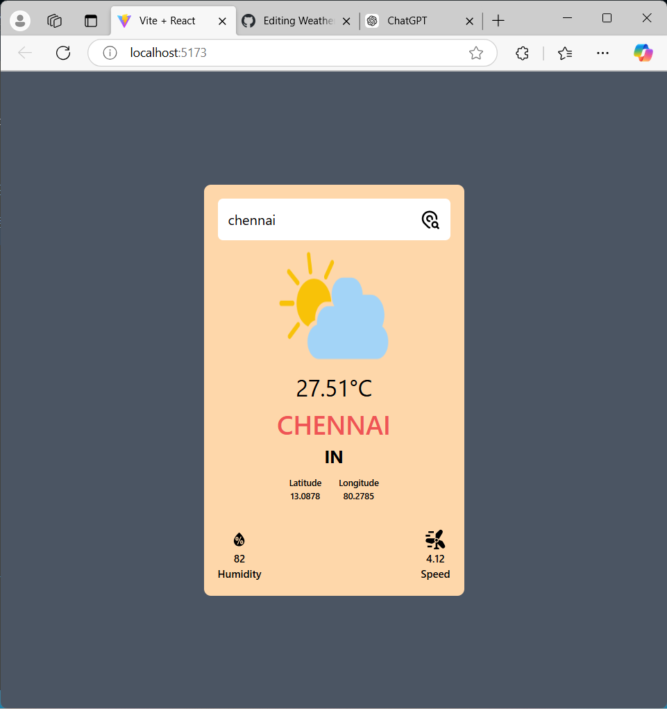
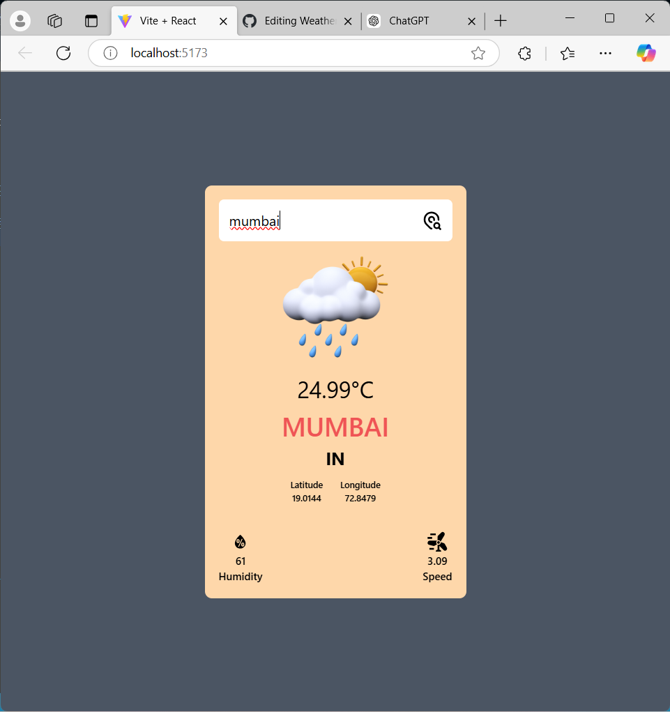
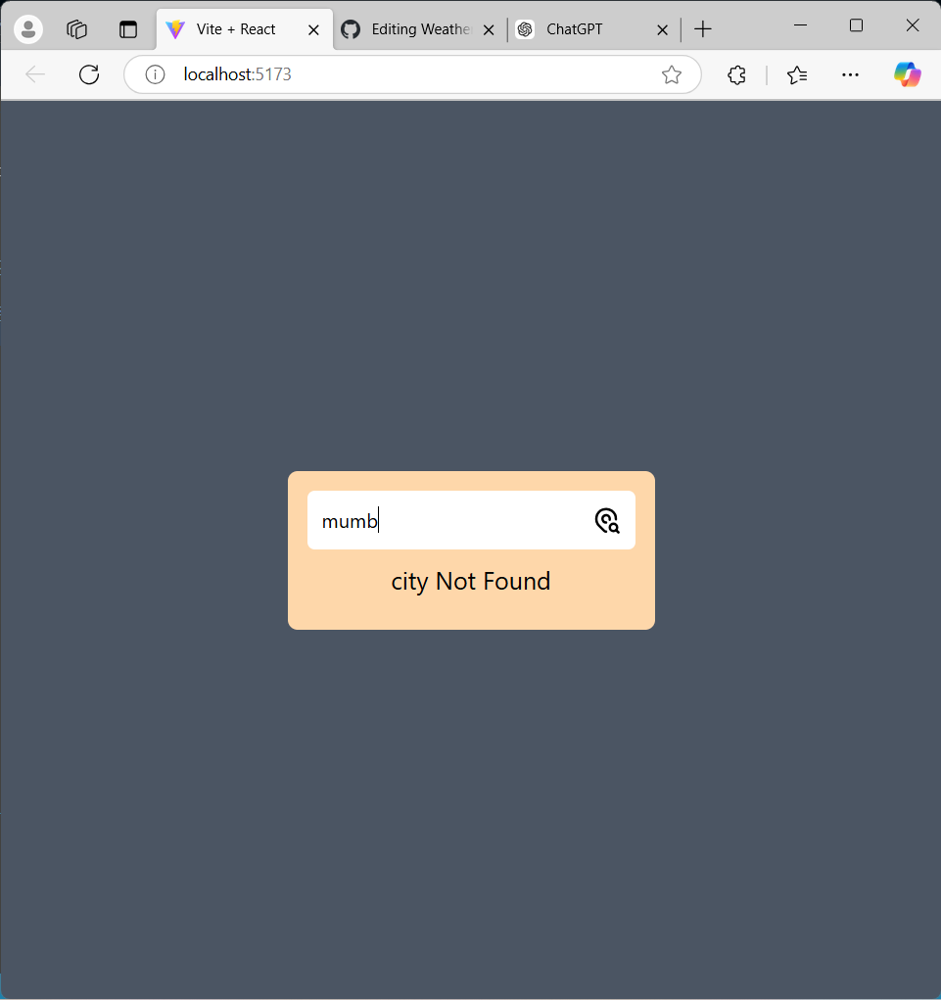

# Weather App 🌦️  

## Description  
The Weather App is a simple and user-friendly application that provides real-time weather updates for any location worldwide. It displays current weather conditions, a detailed forecast, and other essential information, such as temperature, humidity, and wind speed.  

## Features  
- Real-time weather updates for any location  
- 5-day weather forecast  
- Displays temperature, humidity, wind speed, and more  
- Search functionality for city-based weather  
- Responsive design for mobile and desktop devices  

## Technologies Used  
- **Frontend**: ReactJs 
- **API**: [OpenWeather API](https://openweathermap.org/)  
- **Libraries/Frameworks**: fetch (for API calls), tailwind (for styling)  

## Installation  

### Prerequisites  
- Node.js installed on your system (optional for advanced setup)  
- API Key from OpenWeather (Sign up [here](https://openweathermap.org/) for a free API key)  

### Steps  
1. Clone the repository:  
   ```bash  
   git clone https://github.com/your-username/weather-app.git  
   ```  

2. Navigate to the project directory:  
   ```bash  
   cd weather-app  
   ```  

3. Open the `index.html` file in your browser or start a local server if using Node.js.  

4. Add your OpenWeather API key in the appropriate configuration file (e.g., `config.js`):  
   ```javascript  
   const API_KEY = 'your-api-key-here';  
   ```  

## Usage  
- Enter the name of a city in the search bar to fetch weather details.  
- Browse through current and forecasted weather data.  

## Screenshots
### Home Page






## Future Enhancements  
- Add geolocation-based weather updates  
- Provide hourly weather data  
- Include more detailed weather metrics  

## License  
This project is licensed under the MIT License. See the `LICENSE` file for more details.  

## Acknowledgments  
- [OpenWeather API](https://openweathermap.org/) for weather data  
- Inspiration from various weather apps  

---  

Feel free to modify the content based on your specific implementation!
